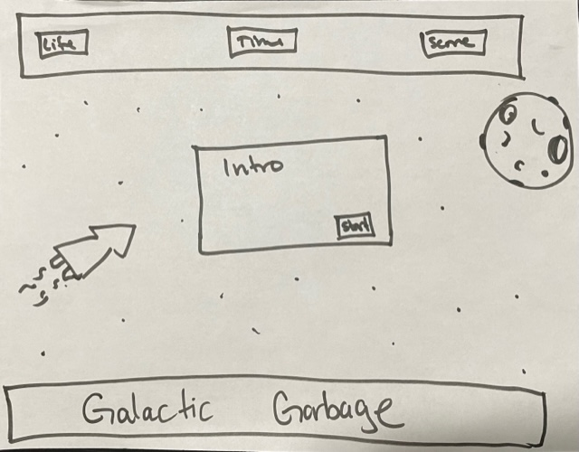
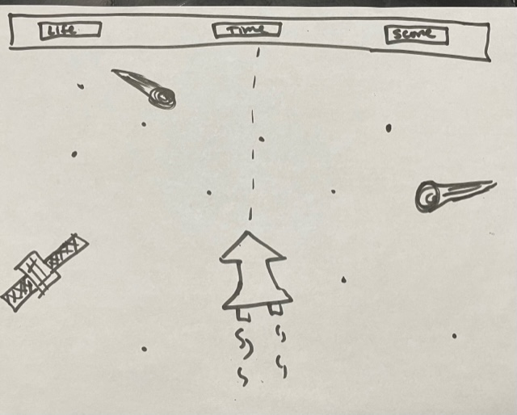
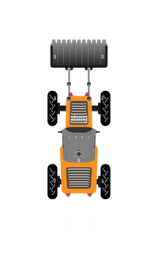
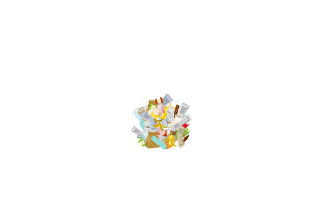

# Galactic-Garbage
This game was inspired by the Atari classic Space Race which debut in 1973. The goal is to move through space without hitting **Galactic Garbage**. Use keys to control the ship: W = Up | S = Down | A = Left | D = Right 

[LAUNCH GAME](https://khonflict.github.io/Galactic-Garbage/)

# Installing game local computer
1. Fork and clone repo
2. Clone to local computer
3. Go to game directory
4. Open index.html in browser 

# Wireframe
Landing page: 

Game page:

# Unsolved Problems
**Images**

I was not able to pass images onto the variables as hoped. 

The image for the ship: 

The image for garbage: 

**Additional Levels**

The inital plan was to create 5 levels with increasing difficulty and different types of garbage. Since I was only able to develop one level I increased the numbers of bebris to make it more challenging. 
